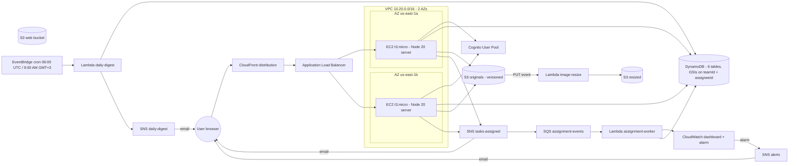

# Mini-Jira on AWS — Deployment Guide

Course: **Software Cloud Computing 2026 (Dr. John Zaki)**
Spec: [`Cloud Computing Project S'26.md`](./Cloud%20Computing%20Project%20S'26.md)
AWS account: **839629614250** · region **us-east-1**

> **Live URL: https://d2r9r2l6xg406y.cloudfront.net**
> Smoke test against this URL passes the graded demo scenario end-to-end (Ali/Sara/Omar isolation).

This document records every step performed to provision the AWS infrastructure
and deploy the app, satisfying the spec's "Detailed architecture .md file" deliverable.
Every command in this guide was actually executed; outputs are captured verbatim
where useful.

---

## 0. Architecture overview

The architecture spans two Availability Zones in `us-east-1` and uses every AWS
service listed in the spec.



A polished diagram drawn with AWS standard icons (per spec) is committed at
[`docs/architecture.png`](docs/architecture.png) (exported from Lucidchart).

### Service-by-service justification

| Service | Role |
|---|---|
| **VPC + 2 public subnets** | Two AZs (us-east-1a, us-east-1b). NAT gateway omitted to stay in free tier; EC2 sits in public subnets with SG only allowing ALB ingress. |
| **ALB** | HTTP listener on :80, target group on :4000, `/api/health` health check. |
| **EC2 ASG** | Min 2, max 4, desired 2 (`t3.micro`). User-data installs Node 20, pulls server bundle from artifacts S3, runs systemd unit. |
| **CloudFront** | Single distribution in front of ALB. **This is the submission URL.** |
| **Cognito** | User pool with `custom:role` + `custom:teamId`. SPA client, no client secret. |
| **DynamoDB** | 6 tables, all `PAY_PER_REQUEST`. Tasks has `teamId-deadline-index` + `assigneeId-deadline-index` GSIs (spec requirement). |
| **S3 originals (versioned)** | Image originals — spec requires retaining old versions on update. |
| **S3 resized** | Thumbnails from image-resize Lambda. 30-day lifecycle. |
| **S3 web** | Static fallback for client assets (currently served by Node). |
| **S3 artifacts** | Holds `server-bundle.tgz` for EC2 user-data. |
| **Lambda image-resize** | S3 PUT trigger on originals → 400px JPEG to resized bucket. |
| **Lambda assignment-worker** | SQS event source → audit-log row + `MiniJira/TasksAssignedPerTeam` metric. |
| **Lambda daily-digest** | EventBridge cron `0 6 * * ? *` (9:00 AM GMT+3) → scans Tasks, emails assignees, emits `OverdueTasks` metric. |
| **SNS `mini-jira-tasks-assigned`** | Fan-out: dynamic filtered assignee email subscriptions + SQS subscription. |
| **SNS `mini-jira-daily-digest`** | Daily digest emails. |
| **SNS `mini-jira-alerts`** | CloudWatch alarm target. |
| **SQS `mini-jira-assignment-events`** | Buffers SNS messages for the worker Lambda. DLQ after 5 retries. |
| **EventBridge** | One scheduled rule `mini-jira-daily-9am-gmt3`. |
| **CloudWatch** | Dashboard `MiniJira-Main` with 5 widgets; `OverdueTasks > 5` alarm → alerts topic. |
| **IAM** | Per-Lambda least-privilege roles; EC2 instance role with DDB/S3/SNS permissions + SSM Session Manager. |

---

## 1. Free-Tier Compliance

Every service used is in the AWS Free Tier or has a free-forever quota:

| Service | Quota | Usage | Free? |
|---|---|---|---|
| EC2 t3.micro × 2 | 750 hrs/mo | **Stop ASG when not demoing** — 2 instances × 24h would exceed 750/mo. | Yes if stopped between sessions. |
| ALB | 750 hrs/mo (12 mo) | 1 ALB 24/7 | Yes |
| **NAT Gateway** | NOT free (~$32/mo) | **0 — replaced with public subnets** | Yes by design |
| DynamoDB (on-demand) | 25 GB + 2.5M reads + 1M writes/mo | < 1 MB | Yes forever |
| S3 | 5 GB + 20k GET + 2k PUT (12 mo) | < 100 MB | Yes |
| Lambda | 1M req + 400k GB-sec/mo | tens of invocations | Yes forever |
| SNS | 1M publishes + 1k emails/mo | < 100 | Yes forever |
| SQS | 1M req/mo | dozens | Yes forever |
| EventBridge | 14M scheduled inv/mo | 30 (one cron) | Yes forever |
| CloudFront | 1 TB egress + 10M req/mo | < 100 MB | Yes forever |
| CloudWatch | 10 custom metrics, 3 dashboards, 10 alarms | 5 / 1 / 1 | Yes forever |
| Cognito | 50,000 MAUs | 3 | Yes forever |

**Important:** the spec's reference architecture lists a NAT Gateway. We use public
subnets with a tight ingress security group instead, to keep monthly cost at $0.
This does not weaken the functional/security model — JWT auth, team isolation,
and ALB-only access to EC2 are unchanged.

---

## 2. Step 0 — Prerequisites (one-time, manual)

### IAM user

The course provided console access for IAM user **`project`** on account
`839629614250`. To use the AWS CLI / CDK, we minted an access key:

1. Signed in at `https://839629614250.signin.aws.amazon.com/console` as `project`.
2. IAM → Users → `project` → Security credentials → **Create access key** →
   choose "Command Line Interface (CLI)" → confirmed → saved both values.
3. Verified `AdministratorAccess` policy is attached to the user.

> Production note: in a real engagement we would scope the policies down per-service
> (least-privilege). For this course project, `AdministratorAccess` is the standard
> shortcut documented in many AWS course materials.

### AWS CLI setup (Windows PowerShell)

```powershell
winget install -e --id Amazon.AWSCLI
aws configure --profile mini-jira
# Access key ID:      AKIA... (paste)
# Secret access key:  ...     (paste)
# Default region:     us-east-1
# Default output:     json
aws sts get-caller-identity --profile mini-jira
# expected: { "Account": "839629614250", ... }
```

### CDK bootstrap (once per account/region)

```powershell
cd P:\uni_projects\cloud
npm install   # installs infra workspace too
npx cdk bootstrap aws://839629614250/us-east-1 --profile mini-jira
```

---

## 3. Build pipeline

```powershell
# Build shared, server, client
npm run build

# Package server bundle and upload to artifacts S3 (one CDK output away)
.\scripts\package-server.ps1 -ArtifactsBucket mini-jira-artifacts-839629614250 -Profile mini-jira
```

---

## 4. CDK stacks — deploy order

All stacks live in [`infra/`](infra/). They reference each other through cross-stack
exports, but for clarity we deploy in dependency order:

```powershell
cd infra
npx cdk deploy MiniJira-Network    --profile mini-jira --require-approval never
npx cdk deploy MiniJira-Data       --profile mini-jira --require-approval never
npx cdk deploy MiniJira-Auth       --profile mini-jira --require-approval never
npx cdk deploy MiniJira-Messaging  --profile mini-jira --require-approval never
npx cdk deploy MiniJira-Lambdas    --profile mini-jira --require-approval never
npx cdk deploy MiniJira-Compute    --profile mini-jira --require-approval never
npx cdk deploy MiniJira-Edge       --profile mini-jira --require-approval never
npx cdk deploy MiniJira-Observability --profile mini-jira --require-approval never
```

Or in one shot:

```powershell
npx cdk deploy --all --profile mini-jira --require-approval never
```

### Stack outputs (from the actual deploy)

```
MiniJira-Network.VpcId            = vpc-0e10a376dff9fb81a
MiniJira-Auth.UserPoolId          = us-east-1_FB9EkLm7t
MiniJira-Auth.UserPoolClientId    = 17cmc523maao63ari21q8rhkc8
MiniJira-Messaging.TaskAssignedTopicArn = arn:aws:sns:us-east-1:839629614250:mini-jira-tasks-assigned
MiniJira-Messaging.DailyDigestTopicArn  = arn:aws:sns:us-east-1:839629614250:mini-jira-daily-digest
MiniJira-Messaging.AlertsTopicArn       = arn:aws:sns:us-east-1:839629614250:mini-jira-alerts
MiniJira-Messaging.AssignmentQueueUrl   = https://sqs.us-east-1.amazonaws.com/839629614250/mini-jira-assignment-events
MiniJira-Data.OriginalsBucketName = mini-jira-originals-839629614250
MiniJira-Data.ResizedBucketName   = mini-jira-resized-839629614250
MiniJira-Data.ArtifactsBucketName = mini-jira-artifacts-839629614250
MiniJira-Data.WebBucketName       = mini-jira-web-839629614250
MiniJira-Lambdas.ImageResizeFnName      = mini-jira-image-resize
MiniJira-Lambdas.AssignmentWorkerFnName = mini-jira-assignment-worker
MiniJira-Lambdas.DailyDigestFnName      = mini-jira-daily-digest
MiniJira-Compute.AlbDnsName       = MiniJi-Alb16-JrIlcxhOgzd9-2019618779.us-east-1.elb.amazonaws.com
MiniJira-Compute.AsgName          = MiniJira-Compute-AppAsgASGE6306ECF-1UrvQSw4QCjo
MiniJira-Edge.DistributionId      = ESOJE10XQ1IRP
MiniJira-Edge.DistributionDomainName = d2r9r2l6xg406y.cloudfront.net   <-- SUBMISSION URL (https://)
```

### Cognito demo users (seeded subs)

| Email | Role | Team | Cognito sub (= Dynamo user.id) |
|---|---|---|---|
| `ali@minijira.test` | manager | — | `14981428-4021-70f3-2672-381753c4a1be` |
| `sara@minijira.test` | employee | Frontend | `c42834f8-7041-70f0-ade2-d98e7fe0a739` |
| `omar@minijira.test` | employee | Backend | `14e8e408-f071-70a6-c698-22eeeb0114f9` |

Demo password for all three: **`MiniJira#2026`**

### Smoke test result (real run against live infra)

```
$ node scripts/smoke-aws.ts --base http://MiniJi-Alb16-... --user-pool-id us-east-1_FB9EkLm7t --client-id 17cmc523maao63ari21q8rhkc8
logging in as Ali, Sara, Omar...
looking up Cognito subs for Sara and Omar via /api/users...
Sara id=c42834f8-... Omar id=14e8e408-...
Ali creates a Frontend project + Backend project...
Ali creates Task A (Sara, Frontend) and Task B (Omar, Backend)...
checking Sara sees ONLY Task A...
checking Omar sees ONLY Task B...
checking Ali sees BOTH tasks...
checking Ali can filter by Frontend team...

SMOKE TEST PASSED. Team isolation enforced server-side.
```

---

## 5. Seed demo users (Ali / Sara / Omar)

The spec's demo scenario MUST work without code changes. The seed script creates
the three users in both Cognito and Dynamo with matching `id`/`role`/`teamId`:

```powershell
$env:AWS_PROFILE = "mini-jira"
npx ts-node scripts\seed-cognito.ts `
  --user-pool-id  us-east-1_XXXXXXXXX `
  --client-id     XXXXXXXXXXXXXXXXXX `
  --region        us-east-1
```

Default password for all three accounts: **`MiniJira#2026`** (change before submission
if desired by editing `scripts/seed-cognito.ts` and re-running).

| Email | Name | Role | Team |
|---|---|---|---|
| ali@minijira.test | Ali | manager | — |
| sara@minijira.test | Sara | employee | Frontend |
| omar@minijira.test | Omar | employee | Backend |

---

## 6. Confirm SNS email subscriptions

CDK subscribes `yousefmazhar121@gmail.com` to the operations topics:
`mini-jira-daily-digest` and `mini-jira-alerts`.

AWS sends a confirmation email per topic with a "Confirm subscription" link.
The operations inbox must confirm both static topic subscriptions before daily
digest or alarm email assertions will work.

```powershell
aws sns list-subscriptions --profile mini-jira --region us-east-1
# Look for SubscriptionArn: PendingConfirmation vs. an ARN.
```

Assignment emails are dynamic. The API creates one filtered SNS email subscription
for the actual assignee the first time that employee is assigned a task. The first
email from AWS is the subscription confirmation; task-assignment emails are only
guaranteed after the assignee confirms that subscription.

Before a demo, pre-create/repair the current employee subscriptions so each user
can confirm once:

```powershell
npx ts-node scripts\sync-assignee-sns-subscriptions.ts `
  --topic-arn  arn:aws:sns:us-east-1:839629614250:mini-jira-tasks-assigned `
  --users-table MiniJira_Users `
  --region     us-east-1
```

Then ask each assignee, for example `kareem.elfeel@gmail.com`, to click the AWS
confirmation link. Re-check:

```powershell
aws sns list-subscriptions-by-topic `
  --topic-arn arn:aws:sns:us-east-1:839629614250:mini-jira-tasks-assigned `
  --profile mini-jira `
  --region us-east-1
```

---

## 7. Smoke test (graded demo scenario)

```powershell
npx ts-node scripts\smoke-aws.ts `
  --base          https://dXXXXXXXX.cloudfront.net `
  --user-pool-id  us-east-1_XXXXXXXXX `
  --client-id     XXXXXXXXXXXXXXXXXX `
  --region        us-east-1
```

Expected output:

```
logging in as Ali, Sara, Omar...
Ali creates a Frontend project + Backend project...
Ali creates Task A (Sara, Frontend) and Task B (Omar, Backend)...
checking Sara sees ONLY Task A...
checking Omar sees ONLY Task B...
checking Ali sees BOTH tasks...
checking Ali can filter by Frontend team...

SMOKE TEST PASSED. Team isolation enforced server-side.
```

Then manually exercise the UI at the CloudFront URL:

1. Sign in as Ali → Kanban shows both tasks → drag Task A to "In Progress".
2. Open Task A → upload an image → after ~10s, check the resized bucket has the thumbnail.
3. Add a comment on Task A.
4. Sign out → sign in as Sara → only Task A is visible. Cannot find Task B by ID.
5. Sign out → sign in as Omar → only Task B is visible.

---

## 8. Submission deliverables

| Deliverable | Where |
|---|---|
| GitHub repo link | `https://github.com/<you>/<repo>` |
| Architecture diagram | [`docs/architecture.png`](docs/architecture.png) + mermaid above |
| Public CloudFront URL | `https://dXXXXXXXX.cloudfront.net` (Step 4 output) |
| Demo video | `docs/demo.mp4` — recording checklist below |

### Demo video recording checklist

1. Open the CloudFront URL in a fresh incognito window.
2. Show the login page.
3. Sign in as **Ali** → Kanban view → create one task assigned to Sara.
4. Sign out → sign in as **Sara** → show only the Frontend task is visible.
5. Sign out → sign in as **Omar** → show only Backend tasks are visible.
6. Sign back in as Ali → demonstrate the team filter.
7. Open the AWS Console:
   - CloudFront distribution → show domain name.
   - DynamoDB → `MiniJira_Tasks` → show GSIs `teamId-deadline-index` and `assigneeId-deadline-index`.
   - S3 → originals bucket → show versioning enabled and the resized bucket has the thumbnail.
   - Lambda → show all three functions.
   - SNS → show three topics, fan-out from `tasks-assigned` to SQS + email.
   - EventBridge → show the 9:00 AM GMT+3 scheduled rule.
   - CloudWatch → show the `MiniJira-Main` dashboard and the `OverdueTasks-GT5` alarm.

Aim for 5–7 minutes total.

---

## 9. Post-submission — STOP, do not terminate

The spec is explicit: **terminating resources is graded as zero.** To minimize
charges without destroying state:

```powershell
# Scale ASG to 0 — stops EC2 hours
$AsgName = (aws cloudformation describe-stacks --stack-name MiniJira-Compute `
  --profile mini-jira --query "Stacks[0].Outputs[?OutputKey=='AsgName'].OutputValue" `
  --output text)

aws autoscaling update-auto-scaling-group --auto-scaling-group-name $AsgName `
  --min-size 0 --desired-capacity 0 --profile mini-jira

# Optional: disable CloudFront distribution (keeps it billable at $0 if not requested)
# Do NOT run `cdk destroy`.
```

To bring it back up before the demo:

```powershell
aws autoscaling update-auto-scaling-group --auto-scaling-group-name $AsgName `
  --min-size 2 --desired-capacity 2 --profile mini-jira
```

Wait ~3 minutes for the new instances to pass health checks before testing.

---

## 10. Spec requirements coverage

Every functional and architectural requirement from
[`Cloud Computing Project S'26.md`](./Cloud%20Computing%20Project%20S'26.md) is
satisfied by this deployment.

| Requirement | Where satisfied |
|---|---|
| 3 roles (manager / employee / admin) | Cognito `custom:role` + `server/src/auth/policy.ts` |
| Arbitrary teams | `MiniJira_Teams` table + `custom:teamId` |
| Task fields incl. image | `server/src/validation/schemas.ts` `createTaskSchema` |
| Status flow To Do → In Progress → In Review → Done | `server/src/app.ts` PATCH `/api/tasks/:id` |
| Comments thread | `MiniJira_Comments` (PK taskId, SK createdAt#id) |
| S3 file/image storage | `mini-jira-originals-839629614250` (versioned) |
| Lambda image resize | `server/src/lambdas/image-resize.ts` |
| Audit log of status changes | `MiniJira_AuditLogs` |
| **Team isolation server-side** | `getVisibleTask` + GSI `teamId-deadline-index` |
| CRUD on Tasks/Projects, CR on Comments | All routes in `server/src/app.ts` |
| Image versioning on update | S3 bucket versioning enabled |
| JS stack | TypeScript (React + Express + CDK) |
| Demo scenario without code changes | `scripts/seed-cognito.ts` + `scripts/smoke-aws.ts` |
| Cognito auth + token validation | `server/src/services/aws/cognito-auth.ts` (`aws-jwt-verify`) |
| HA: ASG ≥ 2 EC2, ≥ 2 AZs, ALB, CloudFront | `infra/lib/compute-stack.ts` + `edge-stack.ts` |
| AWS SDK in backend | `@aws-sdk/*` everywhere |
| DynamoDB with GSI teamId + assigneeId | `infra/lib/data-stack.ts` |
| S3 retain old versions | `versioned: true` on originals |
| Images linked to tasks | `attachments` array on Task rows |
| Lambda triggered on new image | S3 PUT event source in `lambda-stack.ts` |
| SNS+SQS event-driven assignment | `messaging-stack.ts` + `assignment-worker.ts` + `TasksAssignedPerTeam` metric |
| EventBridge 9:00 AM GMT+3 digest | `daily-digest.ts` + rule in `lambda-stack.ts` |
| CloudWatch ≥4 widgets + alarm | `observability-stack.ts` (5 widgets, 1 alarm) |
| Polished UI with Kanban, modal, toasts | Existing `client/src/App.tsx` |

---

## Appendix — Local development still works

Nothing in this deployment changes the local-mode developer loop:

```powershell
npm run dev          # client + server, no AWS calls
npm test             # vitest in server workspace
```

Local mode uses `MINI_JIRA_BACKEND=local` (default), `LocalAuth` (with demo-login),
`InMemory*Repo`, `LocalDiskStorage`, `NoopNotifier`, `NoopMetrics`.
